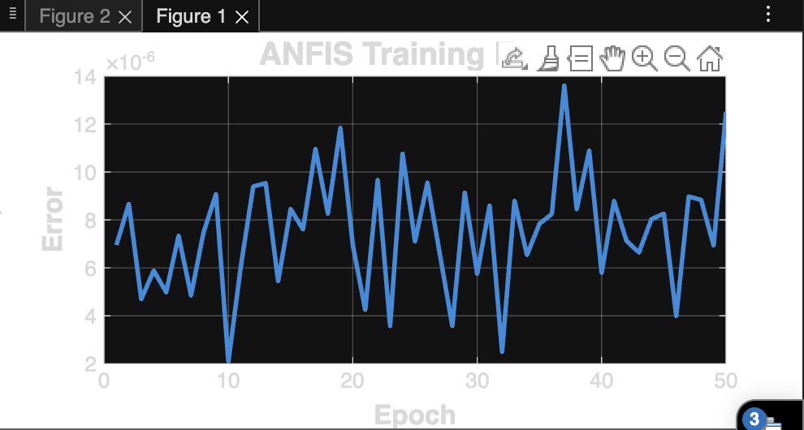
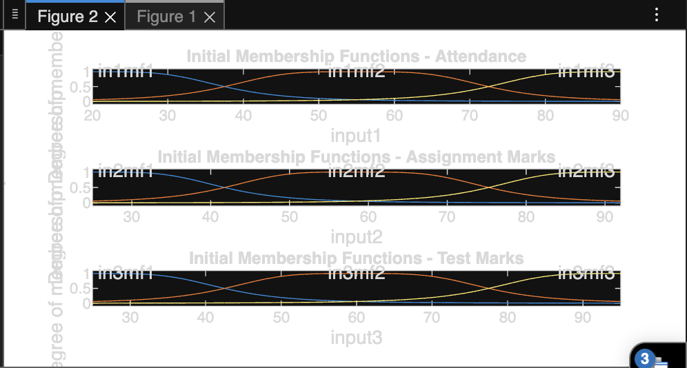
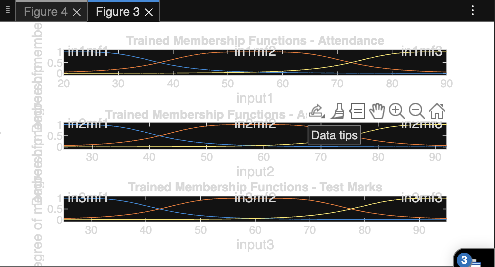
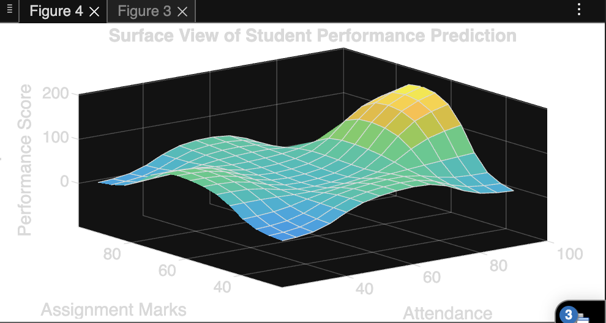
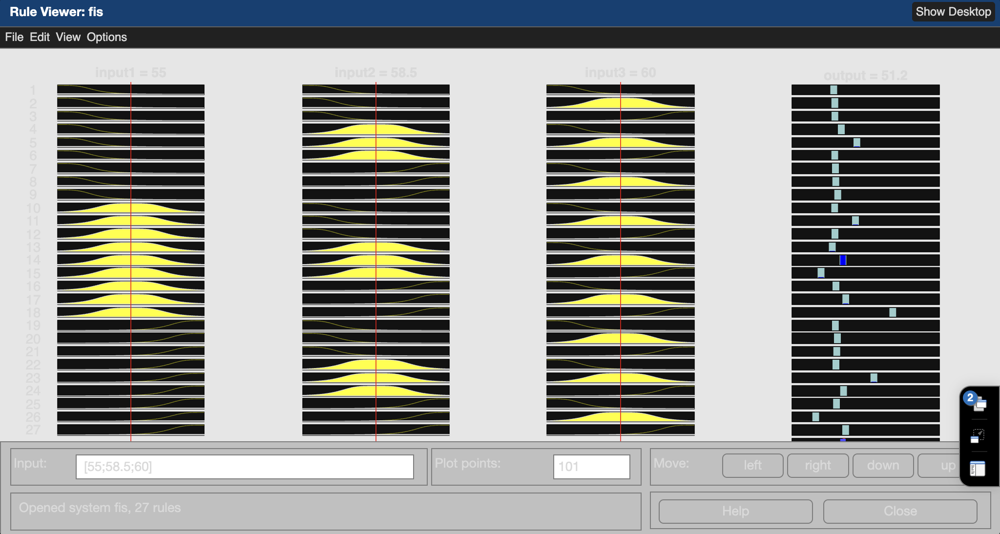

# 🧠 Hybrid Intelligent System for Student Performance Prediction

## 📌 Project Description
This project implements a **Hybrid Intelligent System** combining:
- **Fuzzy Logic** (for human-like reasoning)
- **Neural Networks (ANFIS)** (for learning from data)

The system predicts student performance level based on:
- Attendance
- Assignment Marks
- Test Marks

---

## 🎯 Objective
To design a system that:
- Handles uncertainty using fuzzy logic
- Learns from data using neural networks
- Predicts performance as:
  - Poor
  - Average
  - Good

---

## ⚙️ Tools Used
- MATLAB
- Fuzzy Logic Toolbox
- ANFIS (Adaptive Neuro-Fuzzy Inference System)

---

## 📥 Input Variables
- Attendance (0–100)
- Assignment Marks (0–100)
- Test Marks (0–100)

---

## 📤 Output Variable
- Performance Level:
  - Poor
  - Average
  - Good

---

## Output Screenshots

### 1️⃣ Training Error Graph


---

### 2️⃣ Initial Membership Functions


---

### 3️⃣ Trained Membership Functions


---

### 4️⃣ Surface View (3D Visualization)


---

### 5️⃣ Rule Viewer Output


## 🧠 Hybrid System Explanation

### Fuzzy Logic Part
- Uses linguistic variables (Low, Medium, High)
- Applies IF-THEN rules

### Neural Network Part
- Learns from training data
- Adjusts membership functions automatically

### Integration (ANFIS)
- Combines both approaches
- Improves accuracy and adaptability

---

## ▶️ How to Run

1. Open MATLAB or MATLAB Online  
2. Upload `student_performance_anfis.m`  
3. Run:

```matlab
student_performance_anfis
